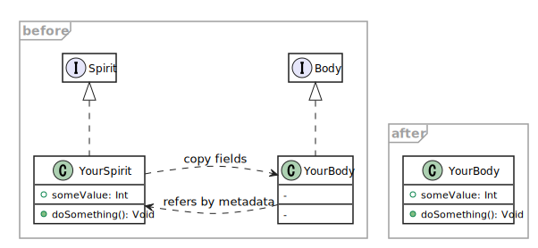

# ripper

A small library to help you create classes.


**Requires Haxe 4** (tested with v4.0.5).


## Features

### Partial Implementation

Inspired by [hamaluik/haxe-partials](https://github.com/hamaluik/haxe-partials).



What it does is just copying fields from a class to another, using the `@:autoBuild` macro.

### Data Class

Completes the constructor of any class according to non-initialized variables.

Similar to [this](https://code.haxe.org/category/macros/build-value-objects.html), but some enhancements as below:

- Ignores variables that already have initial values.
- Respects and integrates existing constructor (if exists).

### Overall

- Source code with every function commented
- Friendly debug log mode (see "Compiler flags" below)


## Caveats

- This is nothing but reinventing the wheel!
- Developed within a few days and haven't considered many usecases yet


## Usage > Partial Implementation

### "Spirit", from which the fields are copied

Prepare a class that you want to use as a component of another class.

Implement `ripper.Spirit` interface here.

```haxe
class Attacker implements ripper.Spirit {
	public function attack() {
		trace('Player attacked!');
	}
}
```

### "Body", to which the fields are copied

Then create a class which actually uses the component above.

Implement `ripper.Body` interface here,  
and specify which class(es) to use in the `@:ripper.spirits` metadata.

```haxe
@:ripper.spirits(Attacker)
class Player implements ripper.Body {
	// This class doesn't have the method attack()
	// but it will be copied from the Attacker class
}
```

### Result

Now every field of the Spirit class (`Attacker` here) is copied to the Body class (`Player` here).

```haxe
class Main {
	static function main() {
		final player = new Player();
		player.attack();
	}
}
```

Finally the output below  
(at default this library prints some [INFO] logs during the compilation.  
 See "Compiler flags" below for details).

```
[INFO]   Player.hx | Player | Copied fields: Player <= Attacker
Attacker.hx:3: Player attacked!
```

### More details

#### Metadata `@:ripper.spirits()` syntax

- It can also have multiple parameters.
- You can write multiple `@:ripper.spirits()` lines as well.
- A module subclass can also be specified.

```haxe
@:ripper.spirits(my_pkg.Attacker, my_pkg.Magician)
@:ripper.spirits(my_pkg.Attacker.HardAttacker)
class Player implements ripper.Body { /* ... */ }
```

The classes can be specified with:
- Absolute package path, or
- Relative package path from the current package  
(however the parent packages cannot be referred.  
Only the classes in the same package or its sub-packages).

#### Using completion server

If you are using [completion server](https://haxe.org/manual/cr-completion-server.html),
sometimes it might go wrong and raise odd errors due to the reusing of macro context.

In that case you may have to reboot it manually (if VSCode, `>Haxe: Restart Language Server`).

#### Sharing fields among classes

To share the same fields between `Body`/`Spirit` classes,  
create another base class that has the fields, and let `Body`/`Spirit` classes extend it.

Although the fields of `Spirit` class are copied to `Body` class,  
fields of super-classes are not copied by this process,  
thus you can avoid "Duplicate class field declaration" errors here.

#### "Override" field

By attaching `@:ripper.override` metadata to any field in a `Spirit` class,  
you can force it to be copied to `Body` class even if the `Body` already has another field with the same name.

#### Verify a class

By adding `@:ripper.verified` metadata to a class that implements `Body` or `Spirit`,  
you can suppress INFO/DEBUG logs and some validations regardless of the compiler flag settings.

#### Preserve Spirit class

At default, a class that implements `Spirit` is excluded from compilation as it is unlikely that it will be used alone.

Add `@:ripper.preserve` metadata to the class to avoid this.

#### Caution: Sharing import/using

If any type is used with `import` (or `using`) in a `Spirit` class,
the module of `Body` class should also import it.

Otherwise you will have "Unresolved identifier" errors.


## Usage > Data Class

By implementing `ripper.Data` interface, the constructor is automatically completed.

For example, this:

```haxe
class MyData implements ripper.Data {
	public final a: Int;
	public final b: Float;
	public final c: String;
	public final d: Int = 0; // Will be ignored as already initialized
}
```

compiles to:

```haxe
class MyData implements ripper.Data {
	public final a: Int;
	public final b: Float;
	public final c: String;
	public final d: Int = 0;

	public function new(a: Int, b: Float, c: String) {
		this.a = a;
		this.b = b;
		this.c = c;
	}
}
```

## Compiler flags

|library|flag|description|
|---|---|---|
|ripper|ripper_validation_disable|Disables all validation during the compilation.|
|sneaker|sneaker_macro_log_level|Less than 300 for hiding WARN/INFO/DEBUG logs. 500 or more for showing all logs.|
|sneaker|sneaker_macro_message_level|Similar to above, but related to compiler messages. Not related to DEBUG logs.|

### Debug logs

With the flag `sneaker_macro_log_level` you can also see more detailed log messages when compiling.

If `500` or more (this will include all DEBUG logs), for example:

```
[DEBUG]  Initialize Spirit fields map. (ripper.macro.SpiritMacro::fieldsMap)
[DEBUG]  Player.hx | Player | Start to build Body class.
[DEBUG]  Player.hx | Player | Start to process metadata parameter: Attacker
[DEBUG]  Player.hx | Player | Start to search type: Attacker
[DEBUG]  Player.hx | Player | Resolving module...
[DEBUG]  Player.hx | Player |   Attacker => Found.
[DEBUG]  Player.hx | Player | Found type: Attacker
[DEBUG]  Player.hx | Player | Resolving as a class.
[DEBUG]  Attacker.hx | Attacker | Start registration of Spirit fields.
[DEBUG]  Attacker.hx | Attacker | Registered Spirit fields for copying to Body.        
[DEBUG]  Attacker.hx | Attacker | Exclude this type from compilation. End registration.
[DEBUG]  Player.hx | Player | Resolved type as a class: Attacker
[DEBUG]  Player.hx | Player | Copying fields...
[DEBUG]  Player.hx | Player |   - attack
[INFO]   Player.hx | Player | Copied fields: Player <= Attacker
[DEBUG]  Player.hx | Player | End building.
```

## Dependencies

- [sinker](https://github.com/fal-works/sinker) v0.3.0 or compatible
- [prayer](https://github.com/fal-works/prayer) v0.1.3 or compatible
- [sneaker](https://github.com/fal-works/sneaker) v0.10.0 or compatible

See also:
[FAL Haxe libraries](https://github.com/fal-works/fal-haxe-libraries)
